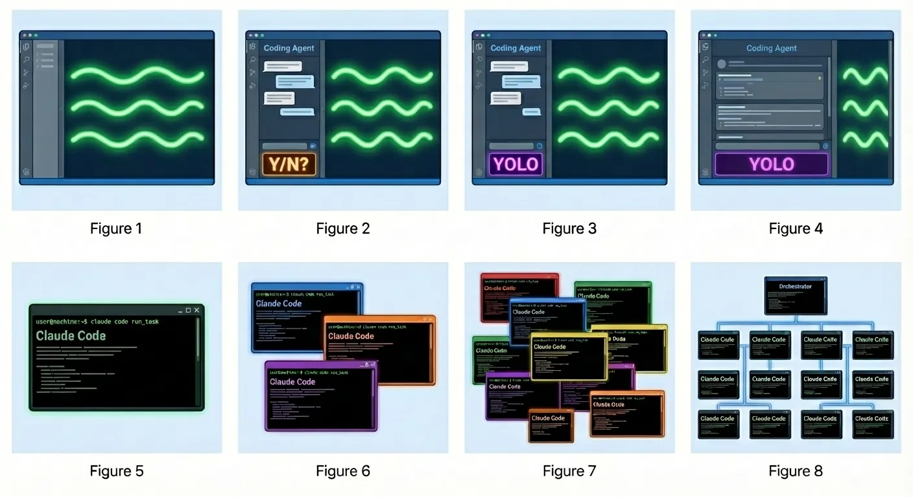

# Agentic Software Development
> "Agentic coding is a software development approach where autonomous AI agents plan, write, test, and modify code with minimal human intervention.
  These agents function more like a skilled contractor than a passive consultant. They understand the goal, break it down into steps, and execute the necessary actions to complete the work."

https://cloud.google.com/discover/what-is-agentic-coding

## Agentic coding versus "vibe coding"
The term, coined by AI researcher Andrej Karpathy in early 2025, describes a workflow where the primary role shifts from writing code line-by-line to guiding an AI assistant to generate, refine, and debug an application through a more conversational process.

Agentic coding, by contrast, is the technological methodology that often enables the vibes.

## Industry standards?
There are none. As of Feb 2026, this is still new enough that no one methodology or framework has emerged as the winner yet.

The turning point when Agile software development overtook Waterfall was around 2015, it took roughly a decade for it to go from "alternative" to "mainstream". Things move a lot faster these days, ChatGPT was released in 2022. It certainly feels like another turning point could be on the horizon.

With Agentic development we're not just talking about automating the toil of devs writing code - naturally companies are going to want to use AI to generate requirements, manage teams and run entire projects.

Given a Senior engineer with free reign over a project, and access to agents, or even platforms of multiple agents - maybe Agile will just get in the way. If the name of the game is faster iteration, do our  rituals and ceremonies slow us down?

Personally, I think it's still too early to tell.

### Ideas for success
In this early stage of agentic coding, I've got a few ideas on guiderails and methods of mitigating some risk...

- **Human-in-the-loop**. Ensure someone on the team reviews code using the same pull request review process as they would with a human-made PR.
- Hire experienced developers that could do the job without agents, but use agents to boost productivity. This de-risks the shitshow that could stem from hiring someone who doesn't understand the code they're committing. 
- Standards. Not just coding standards but **Agentic workflow standards**. If I set up Claude to write a .NET app - someone who has never touched that codebase should be able to drop-in and use a shared config. The dev experience should be repeatable.
- When starting out, **continuous improvement** is paramount. Don't be afraid to burn and reject 100% of the code if it doesn't meet your standards. But LEARN from the mistakes.
- LLM's shouldn't be treated as members of the team. **They are a productivity tool - not decision makers.**
- Agentic development has the same "success triggers" as regular software development. Without clear requirements and a product strategy that makes sense, it doesn't matter how quickly you can generate code.
- [Best practices for secure agentic development](#best-practices-for-secure-agentic-software-development)

## Human-in-the-loop
Human-in-the-loop (HITL) is an architectural pattern in which human feedback is required to guide the decision-making of an LLM application and provide supervision. Within the realm of artificial intelligence, HITL signifies the presence of human intervention at some stage in the AI workflow.

Human-in-the-loop (HITL) in agentic coding means that autonomous coding agents don’t operate in isolation—they collaborate with humans at key decision points. The agent can plan tasks, generate code, run tests, refactor, and even propose architectural changes, but a human reviews, approves, or corrects these actions before they become authoritative.

This oversight can be lightweight (accept/reject diffs, confirm plans) or heavy (design reviews, constraint setting), and it’s often embedded directly into the agent’s workflow through checkpoints, feedback loops, or confidence thresholds that trigger human intervention.

In practice, HITL turns agentic coding into a control system rather than full automation. Humans provide intent, context, and judgment—especially around ambiguous requirements, security, ethics, and long-term maintainability—while agents handle speed, scale, and iteration.

Feedback from the human is then fed back into the agent’s next actions, improving alignment and reducing error propagation.

The result is a hybrid model where agents accelerate development, but humans remain accountable for correctness, direction, and risk.

## Risks
- It's already expensive. Misuse and waste can incur massive costs.
- Anthropic and OpenAI (as of Feb 2026) are still making astronomical losses on their models. If you accelerate adoption and become reliant, you could face Enshitification and skyrocketing costs as they inevitably increase the pricing of their offerings.
- We can't be shipping 50,000 lines of code in a day, it's unsustainable - we should NOT be able to say "I've never seen the code".
- Halloucinations. Oh you have tests? The Tests now assert that halloucination was halloucinated correctly.
- A bad SDLC will still result in a bad product.

## Ralph

https://github.com/snarktank/ralph

Stemming from an [article](https://ghuntley.com/ralph/) by Geoffrey Huntley.

Huntley describes the software as "a bash loop that feeds an AI's output (errors and all) back into itself until it dreams up the correct answer. It is brute force meets persistence." He calls the code and the technique it enables "Ralph," a homage to 1980s slang for vomiting, and to Simpsons character Ralph Wiggum and his combination of ignorance, persistence, and optimism.

"Humans remain in the loop, but enter the software development process later and less often than is the case today."

Anthropic even picked up on the trend and released a [Ralph plugin](https://github.com/anthropics/claude-code/tree/main/plugins/ralph-wiggum) for Claude Code.

I think this quote from Huntley is important:
> While I was in SFO, everyone seemed to be trying to crack on multi-agent, agent-to-agent communication and multiplexing. At this stage, it's not needed. Consider microservices and all the complexities that come with them. Now, consider what microservices would look like if the microservices (agents) themselves are non-deterministic—a red hot mess.
>
> What's the opposite of microservices? A monolithic application. A single operating system process that scales vertically. Ralph is monolithic. Ralph works autonomously in a single repository as a single process that performs one task per loop.

He talks about "Ralphing" here - https://ghuntley.com/loop/

## Gastown
Multi-agent orchestration system for Claude Code with persistent work tracking.

https://github.com/steveyegge/gastown

https://steve-yegge.medium.com/welcome-to-gas-town-4f25ee16dd04

My God. Gastown feels like a shitstorm - and Steve Yegge is the first to admit so **"It’s also 100% vibe coded. I’ve never seen the code, and I never care to"**. Billed as "Kubernetes, but for agents" - it's an orchestration tool for running many agents together to build software. He puts it more poetically, "I predicted someone would lash the Claude Code camels together into chariots, and that is exactly what I’ve done with Gas Town."

It's stage 8 on the diagram. Full orchestration of multiple agents working together with complex relationships between each one to provide redundancy and work-checking fully autonomously. Its main USP is Scale.

## Multiclaude
https://github.com/dlorenc/multiclaude

Multiclaude is an approach to working with Anthropic’s Claude models where multiple Claude instances—or even different Claude versions—are used together as a coordinated system.

Instead of asking one model to do everything, tasks are split or routed: one Claude might focus on planning, another on writing, another on critique or verification. This setup borrows ideas from ensemble methods and multi-agent systems, aiming to get more reliable, nuanced, or creative results by letting models “check” or complement each other.

One Claude can generate a draft, a second can act as a skeptical reviewer, and a third can refine tone or structure based on feedback. The big appeal is robustness: errors, blind spots, or hallucinations from one model are more likely to be caught by another.

## Agentic Development Platforms
Google's Antigravity - https://antigravity.google/

Microsoft Agent 365 - https://www.microsoft.com/en-us/microsoft-agent-365

## Best practices for secure agentic software development
From Google: "Adopting agentic coding in an enterprise environment often requires more stringent security measures and governance. Since agents technically have the autonomy to edit files and execute commands, organizations must treat them with the same scrutiny applied to their own employees, hired contractors, or automated scripts."

### Governance and "scope control"
- **Limit what agents can access**, and prevent it running dangerous commands.
  - Think what's the most damage it can inflict? Full access to GIT and BASH open up a lot of opportunities...
- Let's not let agents delete databases or force-push changes to important branches.
- Apply "**dependency governance**": Ensure agents can only install software from trusted and approved sources
- **Ensure agents log actions and decision-making process**. There should be an audit trail, and changes should meet your standards.
- Are your IT or DevSecOps teams equipped to deal with this?

### Oversight
- Always keep a **Human-in-the-loop**.
- **Enterprise visibility tools** like dashboards to track agent activity, usage quotas and performance metrics.
- Monitor for **prompt-injection** attacks or common **halloucinated** code.

### Testing and assurance
- **Red teaming** - Security professionals can simulate attacks on the agents, to see if it can be tricked into writing insecure code, or revealing sensitive data.
- Use SAST and DAST tools to scan ai-generated code.
- Continuously refine controls: Teams should regularly update their security policies and the system prompts given to AI agents, based on what they find from checks and tests.
- Ultimately, why would you acceptance test an AI project any less than a regular one?