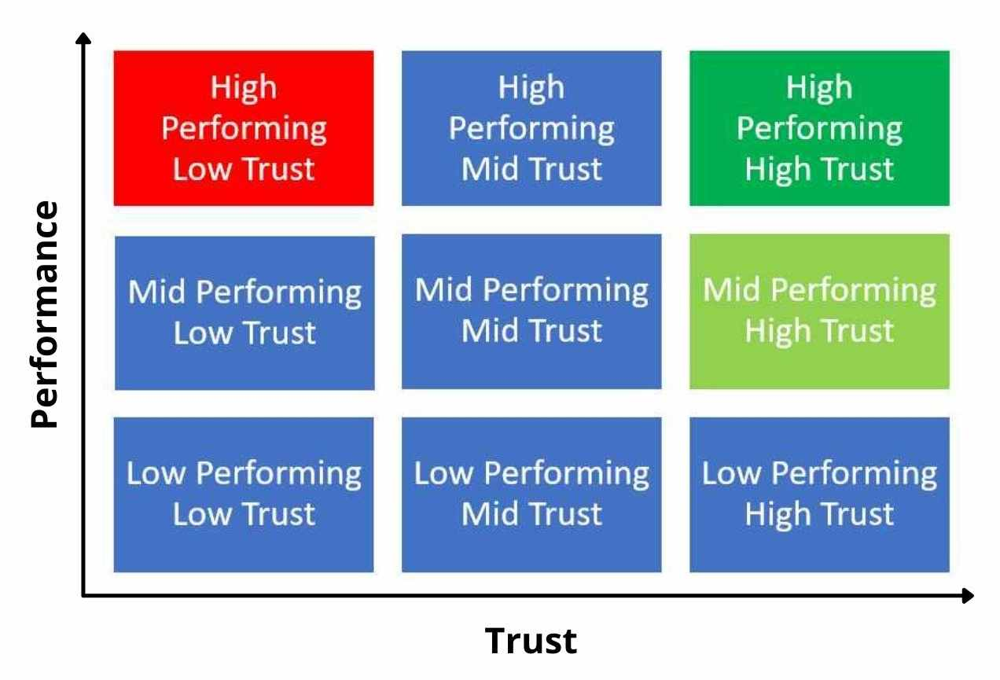

# Performance vs Trust - Brilliant Assholes

The diagram below is a matrix of performance vs trust.

>Performance is an individual's skill, role proficiency or maybe it's "did you meet your KPI?".

>Trust is what kind of person an individual is - are they trustworthy?

**From the Navy Seals:**
- Performance = "Do I trust you with my life?"
- Trust = "Do I trust you with my money or my wife?"

## High Performance, Low Trust
In the matrix, the top left `(High performance, low trust)` is red to indicate a red flag in an employee or potential hire. These people may be incredibly talented, skilled and great at what they do - `brilliant` even - but they are an `asshole`. They may not be a bad person, but they are super difficult to work with and they make others in their teams feel like they can't be vulnerable around them, they aren't trustworthy.

If you asked your office tomorrow, who's the asshole? - it's most likely they'll have a name in mind.

Weeding out these people in interviews is tough and you'll probably get it wrong and hire a `brilliant asshole` at some point in your career. Maybe you already have and they contribute massively to your codebase or project, but these people have a negative effect on long-term morale and productivity. They are `toxic`.

Unfortunately, skill and work output can cloud judgment and these people are often praised in the workplace.

Take it from the Navy Seals `"one of the highest performing organisations on the planet" - Simon Sinek`, they'd much rather hire a `Medium Performer, High Trust` (light green on the diagram) than a `High performance, low trust` (red) individual.

## References
- Simon Sinek - 5:00 into this video: https://youtu.be/nyqLJSclNb4?si=LCawe2Bpjg5UAPAW&t=299
- https://stevebizblog.com/why-you-need-to-use-a-performance-vs-trust-matrix/
