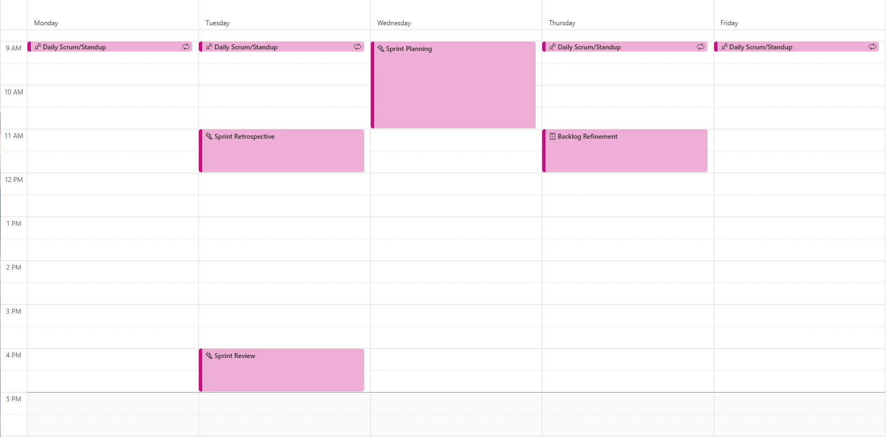
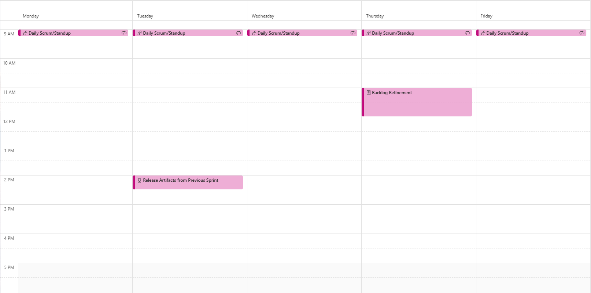

# Calendar

The 2 week sprint in the image below starts with **Sprint Planning**.

Following the day the sprint starts (in this case Wednesday), every morning starts with a **Daily Scrum** (sometimes called **Standup**).

Sprinkled in once per week is **Backlog Refinement**.

The **Sprint Retrospective** and **Review** happens on the last day of the sprint.

As each sprint should end in a releasable state, it's also worth planning in the **Release** activity to trigger a release to users. 

